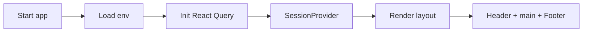
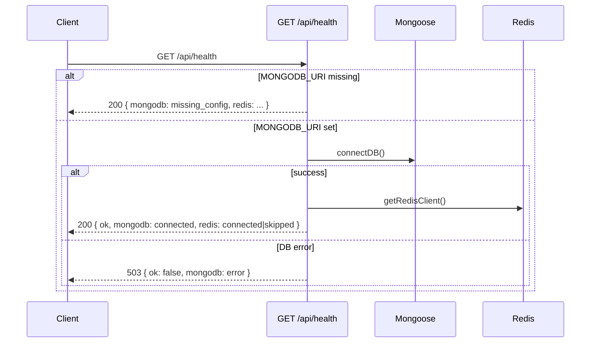
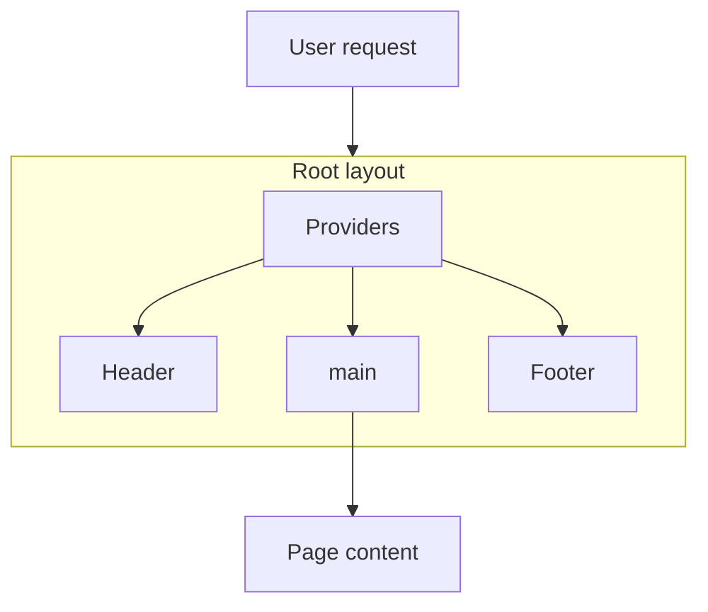

# Phase 1 – Foundation: Flows

**Module:** Project Foundation  
**Requirements ref:** §2 Tech Stack, §3 Architecture

## 1. Application startup flow

## 2. Health check flow

## 3. Page render flow (public)

