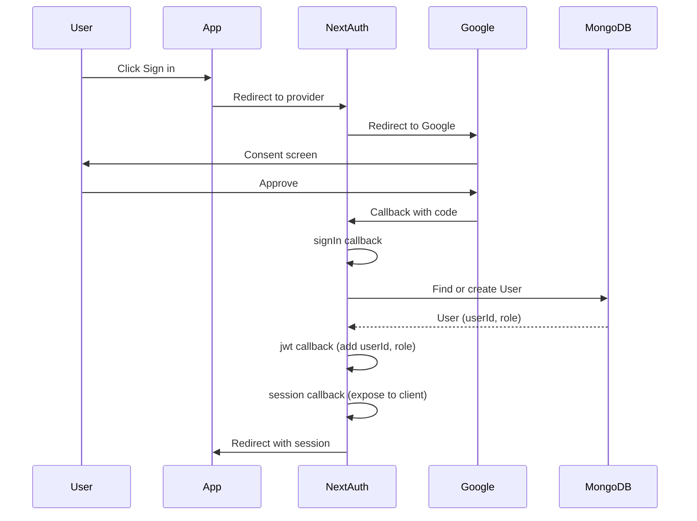
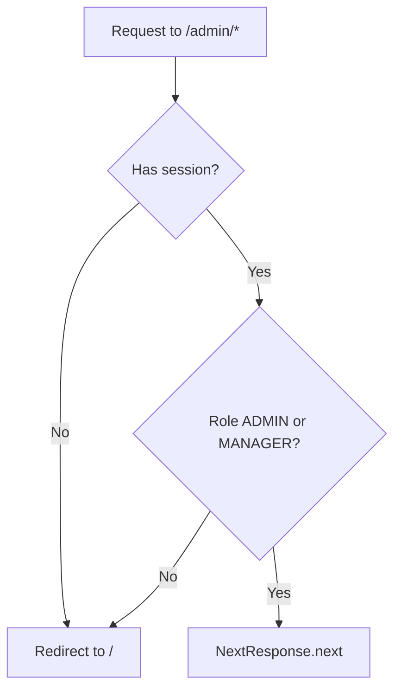
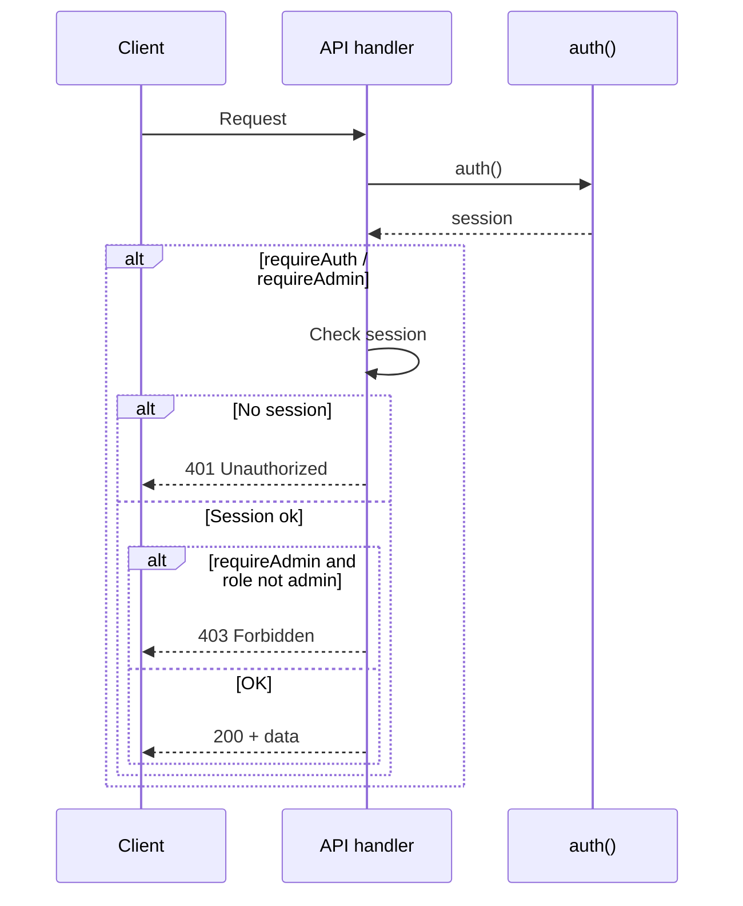

# Phase 2 – Authentication: Flows

**Module:** Authentication  
**Requirements ref:** §2 NextAuth, §9 Security

## 1. Google OAuth sign-in flow

## 2. Middleware – admin protection

## 3. API route auth check flow

