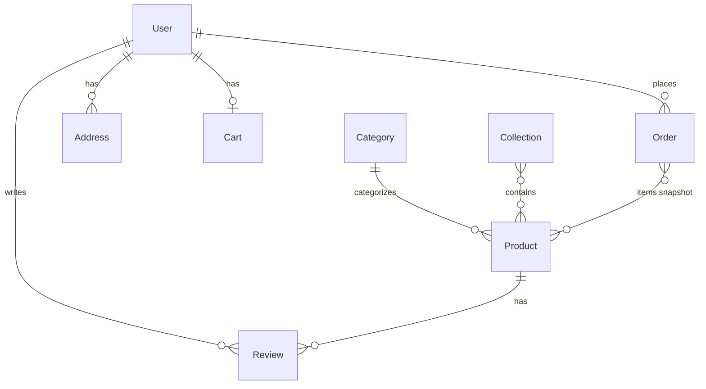
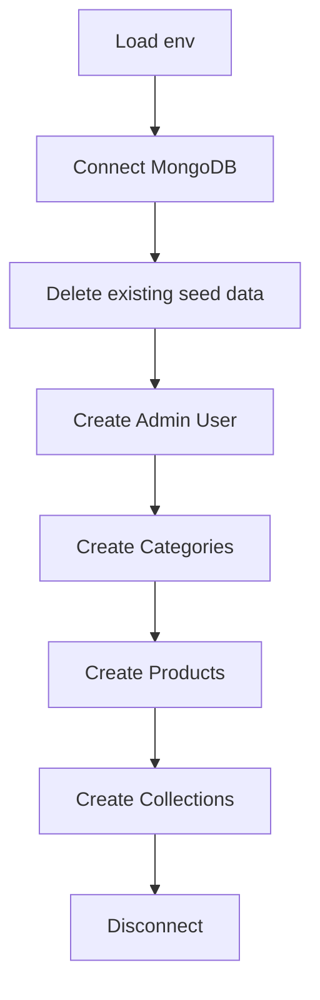

# Phase 3 – Data Layer: Flows

**Module:** Data Layer  
**Requirements ref:** §4 Database Schema

## 1. Entity relationships

## 2. Seed script flow

## 3. Cart TTL and Order rule

- **Cart:** expiresAt set to now + 30 days on create/update; TTL index (expireAfterSeconds: 0) deletes when expiresAt passed.
- **Order:** No delete; status transitions only (PLACED → PROCESSING → SHIPPED → DELIVERED | CANCELLED).
