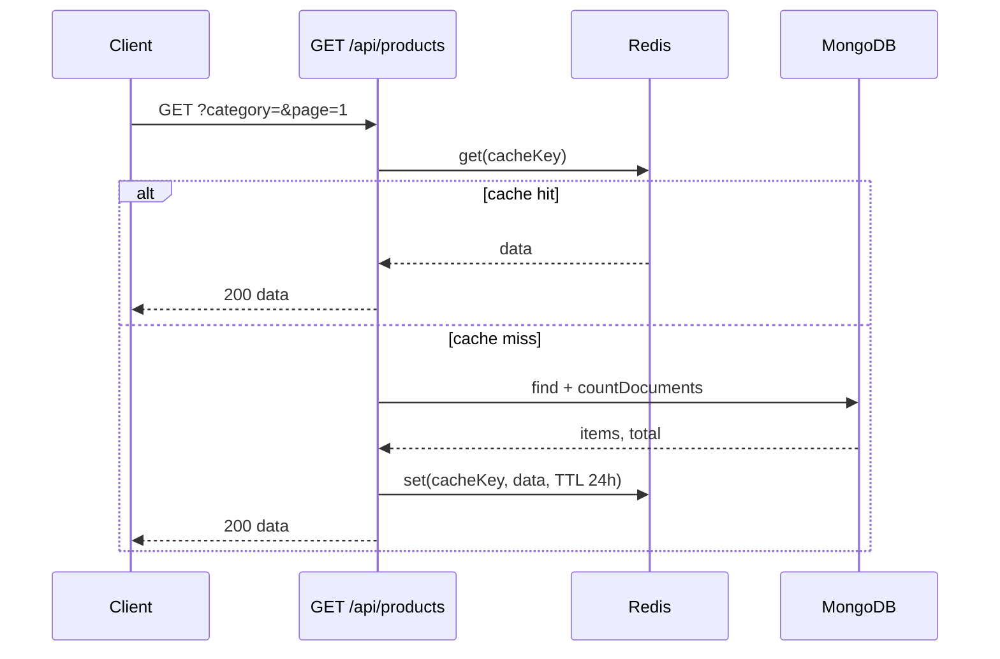
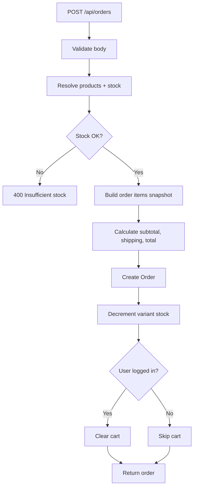
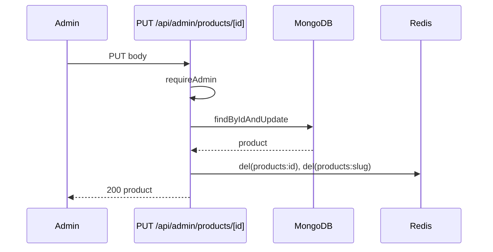

# Phase 4 – Core APIs: Flows

**Module:** Core APIs  
**Requirements ref:** §8 API Endpoints, §3 Caching

## 1. GET product list (with cache)

## 2. Order creation flow

## 3. Admin product update and cache invalidation

