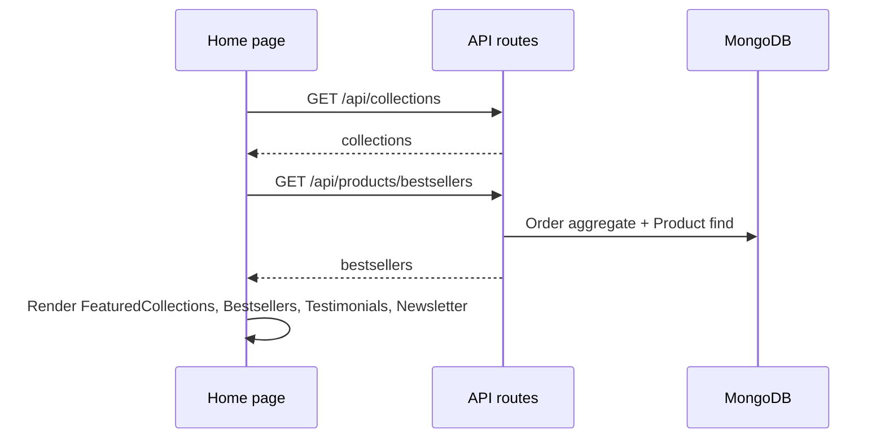
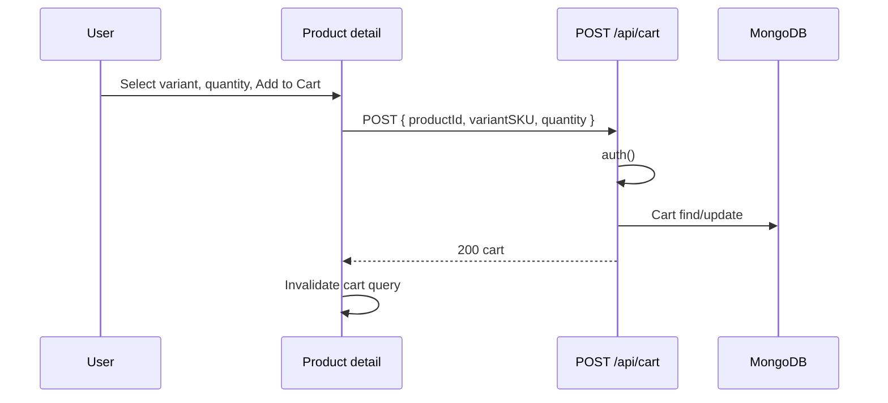

# Phase 5 – User Site Discovery: Flows

**Module:** User Site Discovery  
**Requirements ref:** §5 Pages 1–5

## 1. Navigation flow (discovery)

```mermaid
flowchart LR
  Home[/] --> Collections[/collections]
  Collections --> CollectionDetail["/collection/[slug]"]
  Home --> CollectionDetail
  CollectionDetail --> ProductDetail["/products/[slug]"]
  Home --> Search["/search?q="]
  ProductDetail --> Cart[/cart]
```

## 2. Home data flow



## 3. Add to cart from product detail


