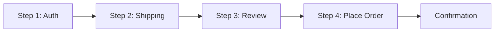
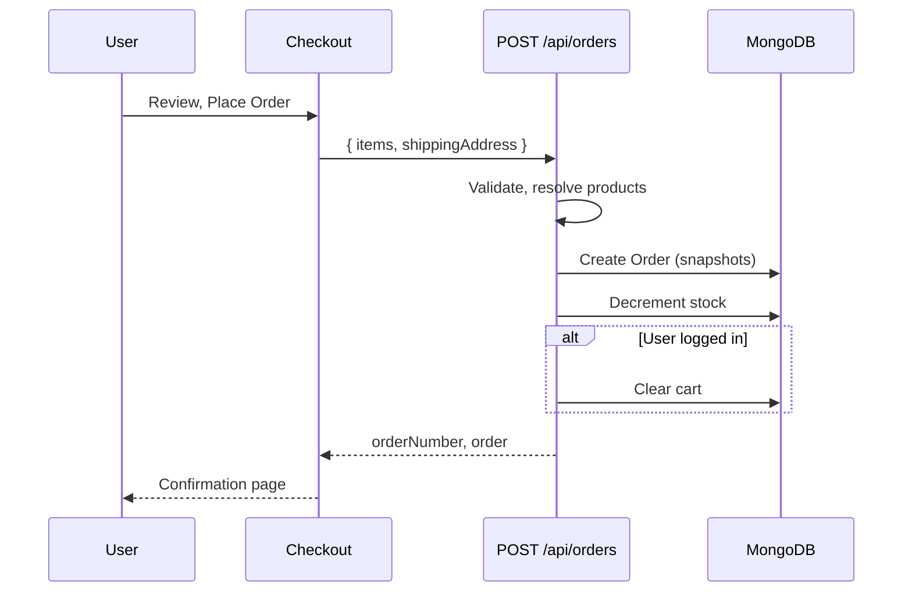

# Phase 6 – User Site Commerce: Flows

**Module:** User Site Commerce  
**Requirements ref:** §5 Pages 6–10, §7 Order Journey

## 1. Checkout step flow

## 2. Order placement flow

## 3. Order status in history

- Order status: PLACED → PROCESSING → SHIPPED → DELIVERED (or CANCELLED).
- User sees status on list and detail; no delete.
