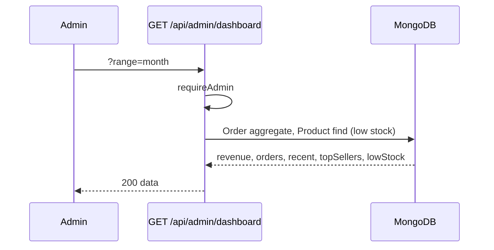

# Phase 7 – Admin Dashboard Core: Flows

**Module:** Admin Dashboard Core  
**Requirements ref:** §6 Dashboard, Products, Orders

## 1. Dashboard data flow

## 2. Product update and cache invalidation

- Admin updates product → PUT /api/admin/products/[id] → DB update → Redis del(products:id), del(products:slug).

## 3. Order status update (no delete)

- Admin selects new status → PUT /api/admin/orders/[id] { orderStatus } → Order.findByIdAndUpdate; no delete.
